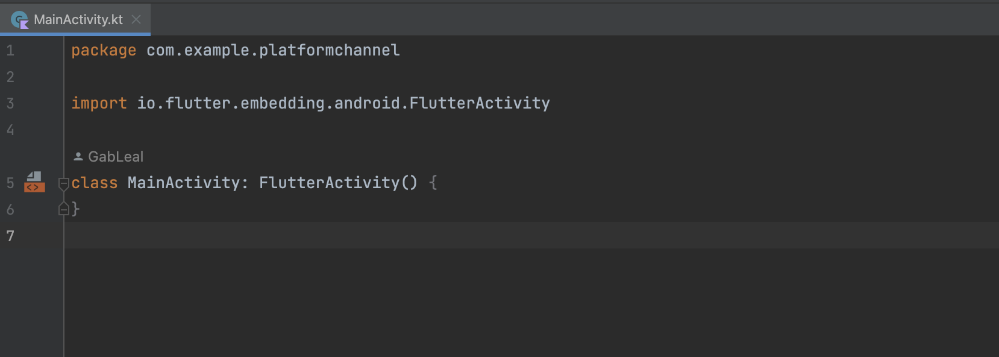
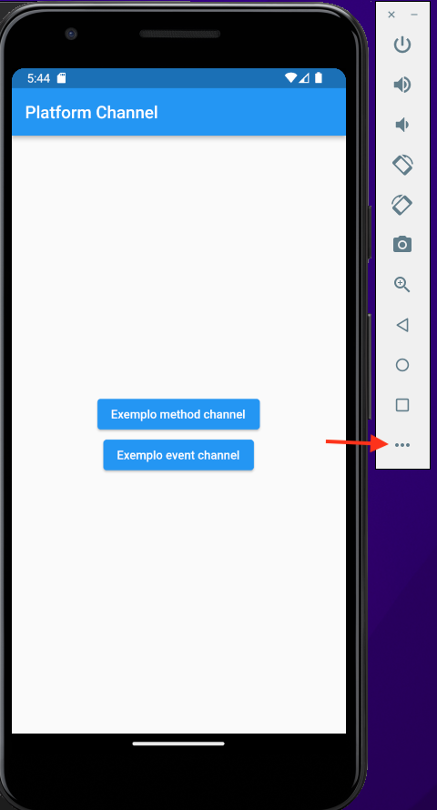
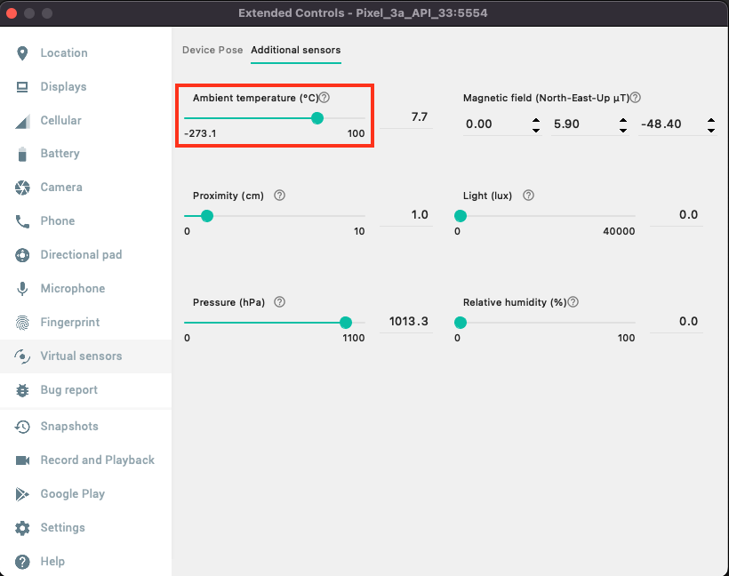
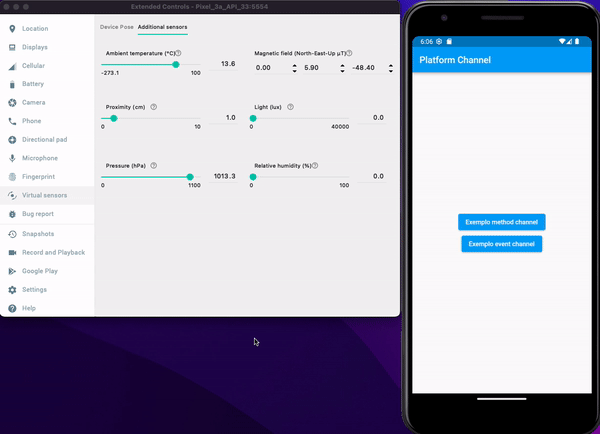

# PlatformChannel: Como estabelecer uma comunicação entre o Flutter e o código nativo

Este tópico tem como objetivo documentar e explicar como funciona o processo de estabelecer uma comunicação entre uma aplicação Flutter e
o código nativo através do mecanismo de platfochannel.

Os métodos que serão abordados funcionam tanto para se comunicar em Kotlin quanto Swift. Contudo, os exemplos abaixo são focados na
plataforma android, pois conseguimos mostrar exemplos mais interessantes com os recursos disponiveis no emulador, pois o simulador do iOS é limitado em relação a recursos como conectividade com sensores, por exemplo.

## Exemplos que essa aplicação oferece
[Modificar o brilho da tela do sistema operacional através de um componente no flutter.](#-modificar-o-brilho-da-tela-do-sistema-operacional)

[Utilizar o sensor de temperatura ambiente do emulador e exibir o valor da temperatura em tempo real no Flutter.](#%EF%B8%8F-sensor-de-temperatura)

## Teoria

O diagrama abaixo representa como funciona a comunicação. O client, aplicação em Flutter, abre um canal através do MethodChannel para se
comunicar com o host. Quando esse canal é criado, através dele podemos executar funções no lado nativo, e caso seja necessário podemos
receber uma resposta dos métodos que foram executados. Para fazer uma analogia, é semelhante a uma requisição GET que fazemos nas
APIs, onde podemos solicitar determinada operação e aguardar por um dado que será retornado e quando isso acontecer podemos manipula-lo
no dart da forma que bem entendermos.


## Prática

Este repositório possui duas branchs. Na main foi disponiblizado o código completo e a baseApp, possui um app base com as telas que vamos usar para este exemplo. Aqueles que quiserem podem utilizar a segunda branch e seguir o passo a passo dessse tutorial.

Para acessar a segunda branch, após clonar o repositório basta usar comando abaixo no seu terminal:
```git
git checkout baseapp
```

### 💡 Modificar o brilho da tela do sistema operacional 
Com o app base na sua máquina, o primeiro passo que vamos realizar antes de começar a mexer com o channel é irmos até o arquivo `AndroidManifest.xml` que fica em `/android/app/src/main` e adicionar a linha abaixo dentro da dentro da TAG `<manifest> </manifest>`

```xml
<uses-permission android:name="android.permission.WRITE_SETTINGS"
tools:ignore="ProtectedPermissions" />
```
Como a atualização do brilho de tela envolve mexer com recursos do próprio sistema operacional precisamos que essa permissão esteja sinalizada no AndroidManifest. Bem semelhante com a permissão de internet, geolocalização e etc.

Uma vez que o passo acima foi realizado podemos focar no channel em si. Agora vamos criar um arquivo chamado `brightness_channel.dart` e colar o trecho de código abaixo:

```dart
import 'dart:developer';
import 'package:flutter/services.dart';

class BrightnessChannel {
  final _brightnessChannel = const MethodChannel(
    'com.example.platformchannel/brightness',
  );

  Future<bool> checkPermission() async {
    try {
      var result = await _brightnessChannel.invokeMethod('checkPermission');
      return result;
    } catch (error) {
      log(error.toString());
      return false;
    }
  }

  Future<void> openPermissionSettings() async {
    try {
      await _brightnessChannel.invokeMethod('openPermissionSettings');
    } catch (error) {
      log(error.toString());
    }
  }

  Future<void> changeBrightnessScreen(int value) async {
    try {
      await _brightnessChannel.invokeMethod('changeBrightnessScreen', value);
    } catch (error) {
      log(error.toString());
    }
  }
}

```

Explicando o código, na linha 5 nós vamos criar uma instância do nosso MethodChannel e como parâmetro devemos passar uma String que vai ser o identificador único desse canal. É recomendável utilizar o nome do pacote do projeto, vito que ele é um identificador único, e concatenar um nome referente a finalidade do channel criado.

Além disso, teremos três funções principais nesse arquivo:

`checkPermission:` Função que verifica se o aplicativo possui permissão para alterar o brilho de tela do dispositivo. Essa função retorna um boleano com o status da permissão.

`openPermissionSettings:` Função que pode redirecionar o usuário para a tela de permissões no dispositivo.

`changeBrightnessScreen:` Função que altera o valor do brilho. Essa função recebe um int que representa a intensidade da luminosidade que a tela deve ter.

As três funções são bastante semelhantes. Todas possuem um try catch, onde no catch apenas realizamos um print log com um possível erro e
nos demais cenários nós utilizamos a seguinte sintaxe:

```dart
await _brightnessChannel.invokeMethod(STRING_NAME_METHOD, [OPCIONAL_PARAM]);
```
Quando usamos a variável que representa a nossa instância MethodChannel podemos acessar o método `invokeMethod`. Essa função recebe como parâmetro uma String que representa o nome da função que queremos executar no lado do nativo (quando chegarmos na parte nativa, vamos entender melhor essa conexão). O segundo parâmetro é opcional. Ao analisar as três funções, veremos que apenas no último caso usamos esse parâmetro opcional. Ele representa um valor que queremos passar para o lado nativo e lá podemos recuperar esse dado que foi passado e realizar alguma operação, por exemplo.

Para realizar a próxima etapa recomendo abrir a pasta `android` do projeto Flutter no próprio Android Studio. Feito isso você deve acessar o arquivo `MainActivity.kt`. Ele deve estar semelhante a imagem abaixo.



O primeiro passo para usarmos o channel no Kotlin é utilizar a função `configureFlutterEngine`. Como no arquivo MainActivity nossa classe já extende a classe FlutterActivity (linha 5 da imagem) quando escrevermos o método já teremos o autocomplete sugerido pela IDE. O próximo passo deve ser criar a comunicaçao do lado do nativo. O código abaixo representa essas duas etapas.

```dart
    override fun configureFlutterEngine(flutterEngine: FlutterEngine) {
        super.configureFlutterEngine(flutterEngine)

        MethodChannel(flutterEngine.dartExecutor.binaryMessenger, CHANNEL).setMethodCallHandler { call, result ->

        }
    }

```

O primeiro parâmetro do MethodChannel é flutterEngine.dartExecutor.binaryMessenger, esse parâmetro diz respeito a como as mensagens serão transmitidas ou recebidas pelo canal. Já o segundo parâmetro é uma String com o nome do channel. É importante que esse nome seja o mesmo que definimos na criação do nosso MethodChannel do dart no lado do Flutter. Feito isso, chamamos o método setMethodCallHandler que é responsável por registrar o nosso channel e disponibilizar ele para uso. Quando registramos o nosso channel temos acesso a duas variáveis call e result. Veremos como elas funcionam, mas de forma resumida: Através da variável call conseguimos pegar os parâmetros que enviamos através do Flutter e com a variável result podemos retornar dados para o Flutter.

O Código abaixo já possui todos os exemplo que vamos precisar para fazer as três funções que criamos no dart funcionar.

```kotlin
import android.content.Intent
import android.os.Build
import android.provider.Settings
import androidx.annotation.RequiresApi
import io.flutter.embedding.android.FlutterActivity
import io.flutter.embedding.engine.FlutterEngine
import io.flutter.plugin.common.MethodChannel

class MainActivity: FlutterActivity() {

  private val BRIGHTNESSS_CHANNEL_NAME = "com.example.platformchannel/brightness"

    @RequiresApi(Build.VERSION_CODES.M)
    override fun configureFlutterEngine(flutterEngine: FlutterEngine) {
        super.configureFlutterEngine(flutterEngine)
        MethodChannel(flutterEngine.dartExecutor.binaryMessenger, BRIGHTNESSS_CHANNEL_NAME).setMethodCallHandler { call, result ->
            when(call.method){
                "checkPermission" ->{
                    val settingsCanWrite = Settings.System.canWrite(context)
                    result.success(settingsCanWrite)
                }
                "openPermissionSettings"->{
                    val intent = Intent(Settings.ACTION_MANAGE_WRITE_SETTINGS)
                    context.startActivity(intent)
                }
                "changeBrightnessScreen"->{
                    var brightnessValue = call.arguments!! as Int
                    Settings.System.putInt(context.getContentResolver(),android.provider.Settings.System.SCREEN_BRIGHTNESS, brightnessValue);
                }
                else ->{
                    result.notImplemented()
                }
            }
        }

    }
}
```

Em Kotlin a estrutura de condição switch pode ser representada pela comando when, onde dado uma String realizamos uma operação diferente para cada uma das opções. Se a string passada não for igual a nenhum desses casos nós caímos no else onde lançamos uma exception para o Flutter avisando que nenhum dos métodos solicitados existe. Lembram do primeiro parâmetro que passamos ao chamar o método `invokeMethod` no Flutter? Aquela String que passamos é acessada dentro dos parenteses do comando `when` usando `call.method`.

Explicação do código acima para cada uma das condições:
- `checkPermission`: Recupera o status que diz se o dispositivo possui permissão para mudar o brilho da tela ou não. Depois de recuperado o status  é retornado para o flutter através do comando `result.success(VALUE)`.
- `openPermissionSettings`:  Recupera a tela de configurações do próprio dispositivo android e ao chamar o método `startActivity` navega para ela.
- `changeBrightnessScreen` Recupera o valor do brilho que foi passado do Flutter para o Kotlin, através do comando `call.arguments!!`, e posteriormente chama a função que muda o brilho da
tela passando o valor obtido.

Para finalizar o primeiro exemplo basta acessarmos o arquivo `method_channel_example_page.dart` e chamar as funções que criamos na classe `BrightnessChannel`. Vamos segui as seguintes etapas:

1. Instanciar o objeto acima do método build.
```dart
final _brightnessChannel = BrightnessChannel();
```

2. No método onChange do componente Slider vamos adicionar o comando abaixo antes do setState que já está dentro dessa função no código que foi disponibilizado.
```dart
 _brightnessChannel.changeBrightnessScreen(value.toInt());
```

3. No onPressed do botão "Verificar permissão" nós vamos adicionar a seguinte lógica:
```dart
bool status = await _channel.checkPermission();
if (status == false) {
  _showPermissionDialog();
}
```
A chamada da funcão `checkPermission` retorna se o usuário possui a permissão necessária para alterar o brilho da tela. Se o usuário ainda não tiver a permissão concedida uma modal irá aparecer solicitando a permissão.

4. No botão da modal chamado "Permissões" vamos adicionar a chamada da função que abre a tela de permissões do android.
```dart
await _channel.openPermissionSettings();
Navigator.pop(context);
```

Feito isso, basta rodar o aplicativo e realizar o teste. Vale ressaltar que se você tentar modificar o brilho da tela antes de conceder a permissão nada irá acontecer e no terminal você receberá um erro dizendo que ainda não possui permissão para mudar as configurações do dispositivo. Se repararmos, quando mudamos a posição do círculo na barra do componente de slides no Flutter e realizamos o scroll para ver a barra de tarefas do android, a barra onde podemos mudar o brilho fica com o círculo no mesmo local que deixamos no Flutter.

`observação:` Se você emular este exemplo pelo computador só conseguirá ver o brilho mudando por conta da barra do próprio sistema operacional que é alterada. Contudo, quando forem testar recomendo emular este primeiro exemplo no device físico para verem a intensidade do brilho mudando.

### 🌡️ Sensor de temperatura
O próximo exemplo que vamos criar é o de enviar dados do sensor de temperatura do android para o Flutter. Este exemplo é um pouco diferente, como não sabemos exatamente em que momento o Kotlin vai enviar os dados para o Flutter não podemos usar o MethodChannel, pois ele abre uma comunicação e depois que os dados são transmitidos o fluxo se encerra. Nesse caso, nós iremos usar o EventChannel, que deixa um canal aberto, onde pode ter dados sendo transmitidos do lado nativo para o Flutter a qualquer momento. O seu fluxo é baseado em Stream (recomendo dar uma estudada em stream caso ainda não saiba como ela funciona).

Primeiro, nós precisamos criar um novo arquivo chamado `temperature_channel.dart` e colar o trecho de código abaixo:

```dart
import 'dart:async';
import 'dart:developer';

import 'package:flutter/services.dart';

class TemperatureChannel {
  final EventChannel _temperatureChannel = const EventChannel(
    'com.example.platformchannel/sensor/temperature',
  );

  final MethodChannel _activeSensorChannel = const MethodChannel(
    'com.example.platformchannel/sensor/activesensor',
  );

  final StreamController<double> _streamController = StreamController<double>();

  TemperatureChannel() {
    _temperatureChannel.receiveBroadcastStream().listen((event) {
      log(event.toString());
      _streamController.sink.add(event);
    }, onError: (e) {
      log(e.toString());
    });
  }

  Stream<double> get getTemperatureStream {
    return _streamController.stream;
  }

  void dispose() {
    _streamController.close();
  }

  Future<void> activeSensor() async {
    try {
      var result = await _activeSensorChannel.invokeMethod('activeSensor');
      log(result.toString());
    } catch (e) {
      log(e.toString());
    }
  }
}
```

No código acima foi criado um objeto do tipo EventChannel que recebe uma String única para representar o nome desse canal. Bem como, foi criado um StreamController do tipo double, esse controlador vai ser responsável por armazenar os valores que recebidos do nativo. O método get `getTemperatureStream` serve para retornar a nossa stream, ele será usado na tela `event_channel_example_page.dart` dentro de um streamBuilder. Além disso, temos o método dispose para limpar a stream quando ela não estiver sendo utilizada. Fazer isso é uma boa prática para limpar recursos que podem ficar consumindo memória do dispositivo. E por último, temos o método construtor da classe, local onde a “mágica” acontece, e uma função responsável por ativa o sensor de temperatura. Dentro do método construtor nós pegamos a nossa instânciado `_temperatureChannel` e acessamos a propriedade `receiveBroadcastStream`. Essa propriedade configura um fluxo de transmissão para receber eventos no canal que nós criamos. Depois disso, acessamos o `listen` para ouvir todos os eventos que chegam nesse fluxo e pegamos todos os dados que recebemos do nativo e jogamos dentro do nosso streamController por meio da função `add`.

Agora, do lado nativo vamos criar a comunicação com o EventChannel. Para fazer isso é simples, basta nós usarmos o seguinte código dentro do função `configureFlutterEngine`, abaixo do `MethodChannel` que foi criado anteriormente.

```dart
EventChannel(flutterEngine.dartExecutor.binaryMessenger, "com.example.platformchannel/sensor/temperature").setStreamHandler(YOUR_STREAM)
```
Ele é semelhante ao MethodChannel, porém usamos o método setStreamHandler e no lugar de YOUR_STREAM nós devemos passar um objeto que seja uma stream. Agora, no código nativo, no mesmo diretório onde temos o `MainActivity.kt` vamos criar uma classe chamada `Temperature.kt` e colocaremos o código abaixo.

```kotlin
package com.example.platformchannel

import android.content.Context
import android.hardware.Sensor
import android.hardware.SensorEvent
import android.hardware.SensorEventListener
import android.hardware.SensorManager
import io.flutter.plugin.common.EventChannel

class Temperature : SensorEventListener, EventChannel.StreamHandler {
    private var sink: EventChannel.EventSink? = null

    private var sensorManager: SensorManager? = null
    private var temepratureSensor: Sensor? = null

    fun start(context: Context){
        sensorManager = context.getSystemService(Context.SENSOR_SERVICE) as SensorManager
        temepratureSensor = sensorManager!!.getDefaultSensor(Sensor.TYPE_AMBIENT_TEMPERATURE)
        sensorManager?.registerListener(this, temepratureSensor, SensorManager.SENSOR_DELAY_NORMAL)
    }

    override fun onSensorChanged(event: SensorEvent?) {
        if(event != null){
            val temperature = event!!.values[0]
            sink?.success(temperature)
        }
    }

    override fun onAccuracyChanged(sensor: Sensor?, accuracy: Int) {
    }

    override fun onListen(arguments: Any?, events: EventChannel.EventSink?) {
        sink = events
    }

    override fun onCancel(arguments: Any?) {
        sink = null
        sensorManager?.unregisterListener(this)
    }

}
```
Essa classe, basicamente é responsável por: Inicializar nosso sensor e publicar os valores obtidos na nossa stream, os quais receberemos no Flutter.

Como dito anteriormente, precisamos que essa classe seja uma stream para usarmos no nosso EventChannel. Além disso, precisamos encontrar uma forma dessa classe obter os dados do sensor de temperatura do Android. Para fazer isso, será necessario implementarmos duas classes:

1. `SensorEventListener:` Classe que permite obter dados dos sensores no android. Ao implementar essa classe é possível fazer o override de duas funções: `onSensorChanged` e `onAccuracyChanged`.
2. `EventChannel.StreamHandler` : Interface que diz que a classe pode ser uma stream. Quando ela é utilizada é preciso fazer o override de duas funções: `onListen` e `onCancel`.

Agora vou explicar de forma breve para que serve cada método desse e o método start que não foi citado anteriormente.

O método start serve para registrarmos o nosso sensor e ativa-lo. Essa função recupera o gerenciador de sensores do andorid, dentro dele vamos ter uma infinidade de possibilidades de sensores, por isso na linha seguinte nós pegarmos um sensor especifico que é o de temperatura ambiente. Por ultimo, nós registramos esse sensor através do `registerListener`.

O método `onSensorChanged` é chamado toda vez que o valor da temperatura ambiente mudar. Quando isso ocorre nós verificamos se o event recebido é diferente de Null, caso seja verdade, recuperamos o valor da temperatura e publicamos na nosso canal. Quando usamos `sink?.success` estamos dizendo que o valor passado por parâmetro será enviado para o Flutter.

Nesse exemplo não precisamos usar a função `onAccuracyChanged`, porém precisamos ter ela implementada pois faz parte do contrato da nossa interface.

O metodo `onListen` é o responsável por configurar o nosso canal de eventos que irá transmitir os dados do nativo para o flutter.

E por ultimo, o método `onCancel` que serve para limpar nossa stream e cancelar o registro do sensor. Fazer isso é uma boa prática para não consumir recursos quando não estivermos mais usando o sensor.

Agora que temos nossa classe de stream criada, basta criarmos uma instância dela na nossa classe MainActivity e passar essa instância no parâmetro do método `setStreamHandler` do EventChannel.

```
private var temperature: Temperature = Temperature()
```

Outro ponto importante é que antes de usarmos o sensor nós precisamos ativar ele. Para fazer isso, nos vamos usar o MethodChannel que está dentro da classe `temperature_channel.dart`. Sendo assim, como feito no exemplo anterior, vamos definir esse novo methodChannel do lado do nativo. O trecho abaixo pode ser colocado abaixo do EventChannel que criamos em MainActivity.kt.


```dart
  MethodChannel(flutterEngine.dartExecutor.binaryMessenger, "com.example.platformchannel/sensor/activesensor").setMethodCallHandler { call, result ->
      when(call.method){
          "activeSensor" ->{
              temperature.start(this.context)
              result.success(true)
          }
          else ->{
              result.notImplemented()
          }
      }
  }
```

Feito isso, podemos ir no nosso arquivo `event_channel_example_page.dart` e criar uma instância da classe `TemperatureChannel`. Dentro do Widget `StreamBuilder` vamos atribuir ao parâmetro stream o nosso método `getTemperatureStream` que foi instanciada.

Criação da instância
```dart
final _temperatureChannel = TemperatureChannel();
```

Atribuindo valor para o parâmetro stream
```dart
  StreamBuilder<double>(
    stream: _temperatureChannel.getTemperatureStream,
    builder:
        (BuildContext context, AsyncSnapshot<double> snapshot) {
      if (snapshot.hasData) {
        return Text("temperatura ${snapshot.data}");
      } else {
        return const Center(
          child: Text(
            "Sem temperatura informada. Antes de alterar a temperatura no emulador ative o sensor de temperatura.",
            textAlign: TextAlign.center,
          ),
        );
      }
    },
  ),
```

Por último, no botão "Ativar sensor de temperatura" vamos chamar a função activeSensor

```dart
  _temperatureChannel.activeSensor();
```

Feito isso, podemos compilar o aplicativo e para testar vamos realizar os seguintes passos no emulador:

1. Clicar no ícone dos três pontinhos. Último ícone da barra que fica do lado do emulador


2. Selecione a opção "Virtual sensors”.


3. Nessa tela você terá acesso a vários sensores que temos em um dispositivo android. No nosso caso vamos utilizar o sensor de "Ambient temperature".




Ao testar o app ele deve se parecer com o resultado abaixo:


